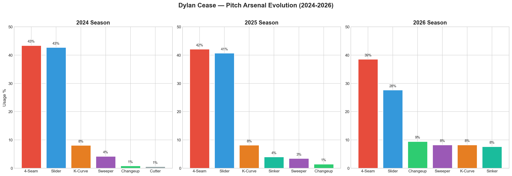
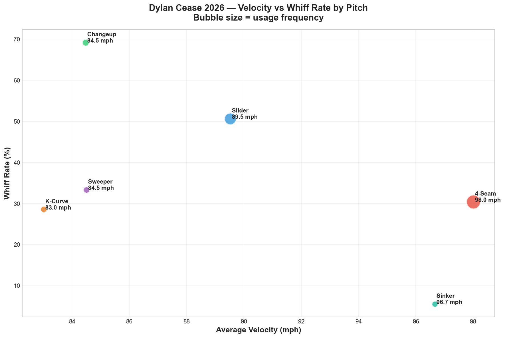
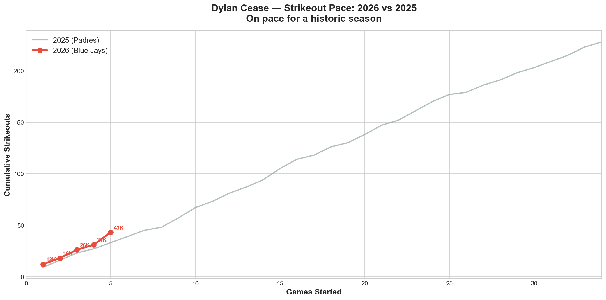
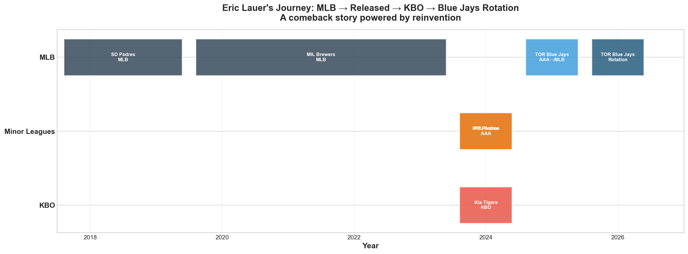
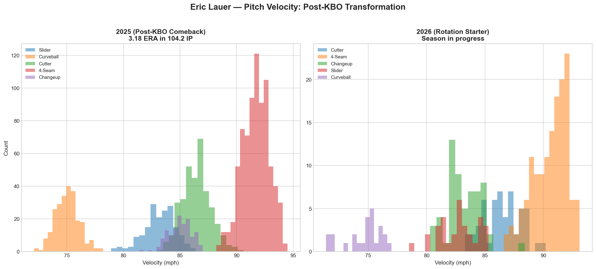
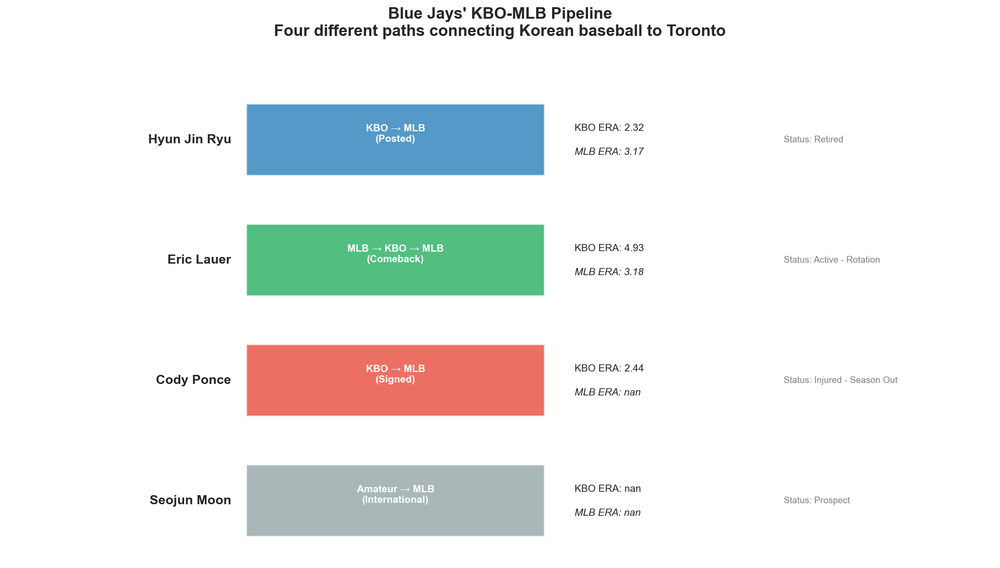
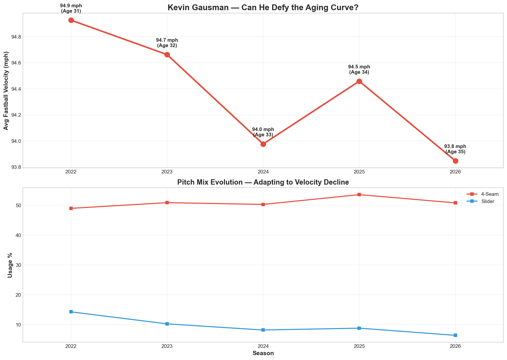
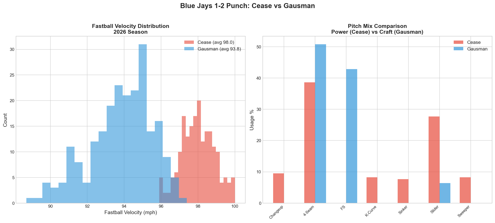

# Toronto Blue Jays 2026 — Pitching Staff Analysis

A Statcast-driven analysis of the 2026 Toronto Blue Jays pitching rotation, examining Dylan Cease's historic strikeout pace, Eric Lauer's KBO-to-MLB comeback, Kevin Gausman's aging curve, and the team's pitching depth.

## Key Findings

### 1. Dylan Cease — The Strikeout Machine

Cease brings a true six-pitch arsenal to Toronto, anchored by a 98.0 mph four-seam fastball and an elite 89.5 mph slider. His pitch mix has diversified from 2024 to 2026, with increased usage of his sweeper, knuckle curve, and sinker — giving hitters more looks to worry about.

His changeup generates an extraordinary ~69% whiff rate despite being thrown only 9% of the time. The 13.5 mph gap between his fastball (98.0) and changeup (84.5) creates devastating timing disruption. His slider, thrown 28% of the time at 89.5 mph, produces a ~50% whiff rate and serves as his primary strikeout pitch.

Through his first five starts as a Blue Jay, Cease leads MLB with 44 strikeouts and is on pace for a historic season. His strikeout accumulation rate significantly exceeds his 2025 pace with San Diego.

### 2. Eric Lauer — The KBO Comeback Story

Lauer's path from MLB starter to being released by two organizations, reviving his career in the KBO with the Kia Tigers (winning the 2024 Korean Series), and returning to become a key contributor for the Blue Jays' 2025 World Series run is one of the most compelling stories in modern baseball.

Post-KBO, Lauer's pitch mix shifted notably. His changeup usage increased while his curveball usage decreased, and his fastball velocity settled around 90-91 mph. The KBO experience appears to have helped him refine his approach — relying on pitch sequencing and command rather than velocity.

### 3. The Blue Jays' KBO-MLB Pipeline

The Blue Jays have become uniquely connected to Korean baseball through four different pathways: Ryu (KBO veteran), Lauer (MLB-KBO-MLB comeback), Ponce (KBO award winner signed to MLB), and Moon (international amateur). This diversity of Korean baseball connections is unmatched in MLB.

### 4. Kevin Gausman — Defying the Aging Curve

At age 35, Gausman continues to perform at an elite level by evolving his pitch mix as velocity naturally declines. His fastball has decreased from its peak, but increased reliance on secondary pitches has maintained his effectiveness — a masterclass in pitcher adaptation.

The Cease-Gausman pairing gives Toronto a rare 1-2 combination: Cease's power approach (98 mph, strikeout-dominant) complemented by Gausman's craft approach (pitch mix diversity, command precision). This contrast makes the Blue Jays rotation difficult to prepare for on consecutive nights.

## Rotation Depth Assessment

The 2026 Blue Jays entered the season with unprecedented pitching depth:

**Active Rotation:** Cease, Gausman, Scherzer, Lauer, (Ponce — injured)

**IL / Expected Returns:** Berríos (elbow stress fracture), Bieber (elbow inflammation), Yesavage (shoulder impingement)

When healthy, Toronto has 8 legitimate starters competing for 5 spots — a luxury few MLB teams can claim. The Ponce injury (season-ending knee) removes one piece, but the eventual returns of Berríos, Bieber, and Yesavage will create difficult roster decisions that indicate organizational depth.

## Methodology

- **Data source:** MLB Statcast via pybaseball Python library
- **Dataset:** 20,000+ pitch-level records across 3 pitchers (2022-2026)
- **Analysis:** Pitch mix evolution, velocity trends, whiff rate calculations, strikeout pace tracking
- **Visualization:** matplotlib with custom styling

## Repository Structure

- `data/` — Statcast CSV files for Cease, Gausman, Lauer (multiple seasons)
- `notebooks/` — Analysis notebooks for each pitcher
- `visualizations/` — All charts and figures

## Connection to Other Work

This project is part of a broader baseball analytics portfolio:

- **[Korean Players in MLB — A Pathway Analysis](https://github.com/seongji-park/korean-players-mlb-analysis)** — A study of Korean amateur signings' development trajectories, with implications for Blue Jays prospect Seojun Moon

The KBO connection thread runs through both projects: Lauer and Ponce's KBO experience in this analysis connects directly to the broader question of how Korean baseball shapes MLB-ready talent.

## Author

**Seongji Park**
Statistics student | Aspiring baseball analytics professional

- GitHub: [seongji-park](https://github.com/seongji-park)
- Email: sungji0826@gmail.com